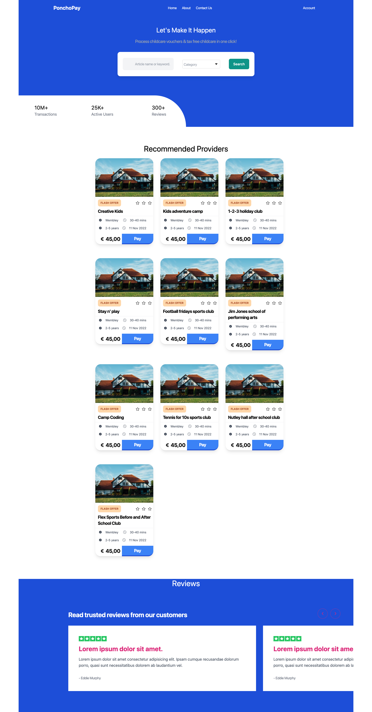

<p align="center">
  <h3 align="center">Ponchopay</h3>
  <p align="center">
    UX Engineer — take home task
  </p>
</p>

<details open="open">
  <summary>Table of Contents</summary>
  <ol>
    <li>
      <a href="#about-the-project">The Task</a>
      <ul>
        <li><a href="#assumptions">Assumptions</a></li>
      </ul>
    </li>
    <li>
      <a href="#getting-started">Getting Started</a>
      <ul>
        <li><a href="#prerequisites">Prerequisites</a></li>
        <li><a href="#installation">Installation</a></li>
      </ul>
    </li>
    <li><a href="#usage">Usage</a></li>
  </ol>
</details>



## About The Project
We want PonchoPay to become the central place parents/carers can make and manage their childcare payments. The task is to design and implement an interactive home screen for PonchoPay, where parents can initiate payments and see their world at a glance. 


### Assumptions
* The user has already logged in and has access to the application to search for providers.
* The List of verified providers are displayed by default and the user can filter out the relevent ones based on filter criteria.

### Built With
* [React](https://reactjs.org/)
* [Tailwind CSS](https://tailwindcss.com/)


## Getting Started

To get a local copy up and running follow these simple example steps.

### Prerequisites

The only prerequisite to run the below program is to have yarn installed.
* Yarn 
  ```
  npm install --global yarn
  ````

### Installation

1. Clone the repository
   ```sh
   git clone https://github.com/dhwaniKhara11/PonchoPay.git
   ```
2. Install dependencies
   ```sh
   yarn install
   ```

## Usage

The below command runs the app in the development mode.
url:  http://localhost:3000
```sh
   yarn start
```
